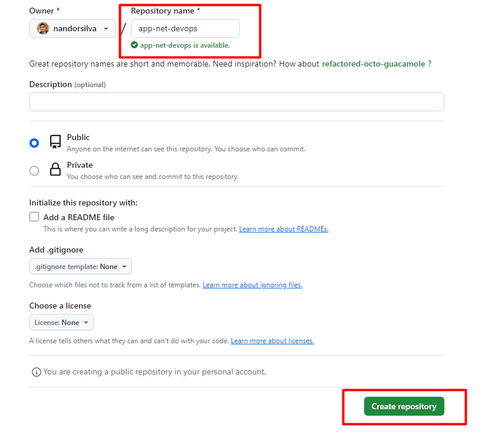
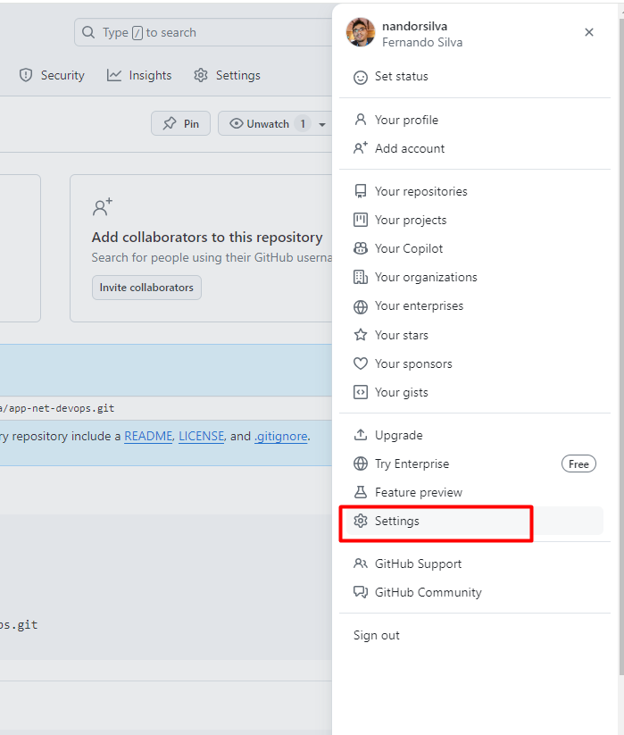
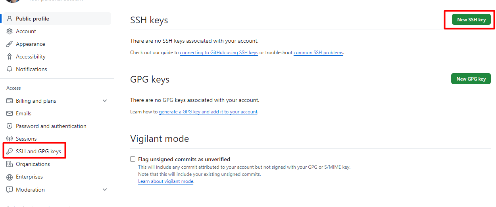
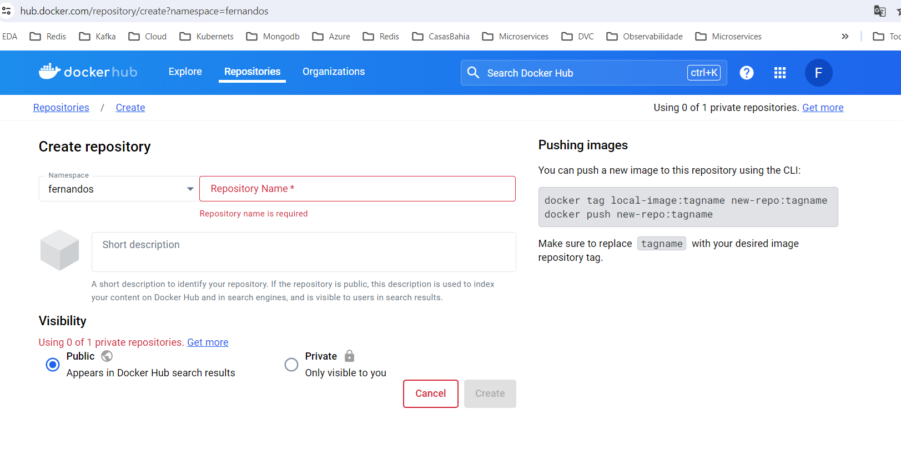
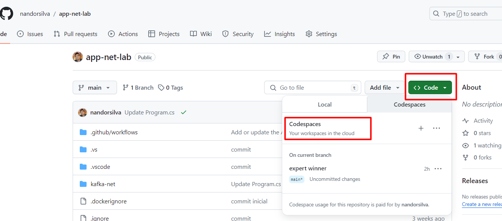
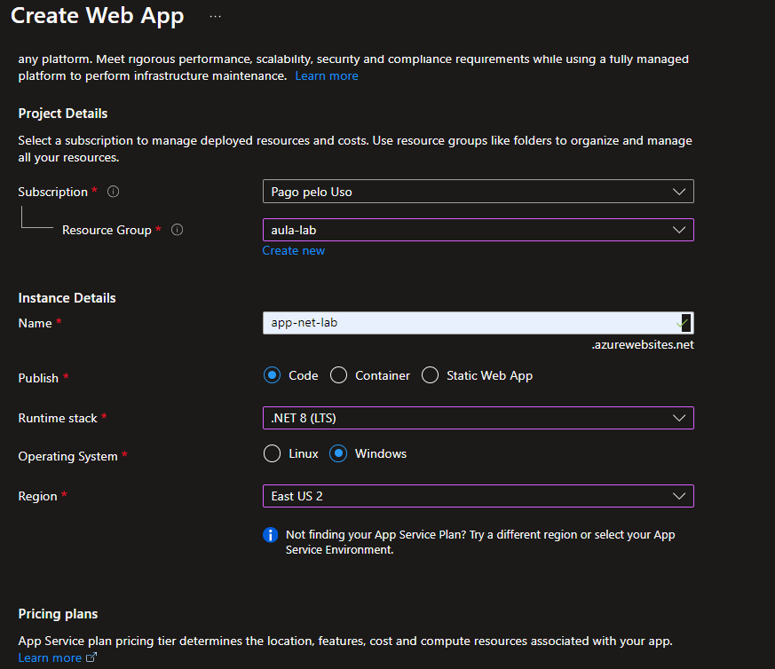
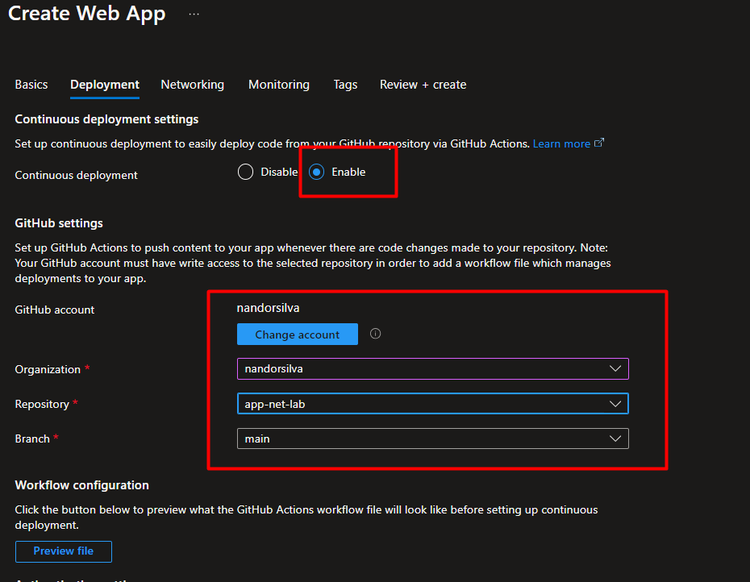
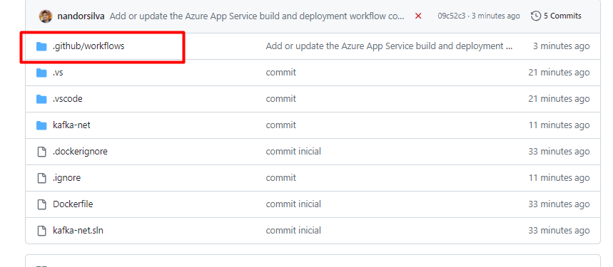
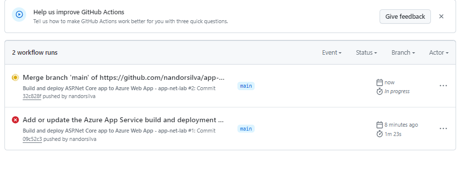
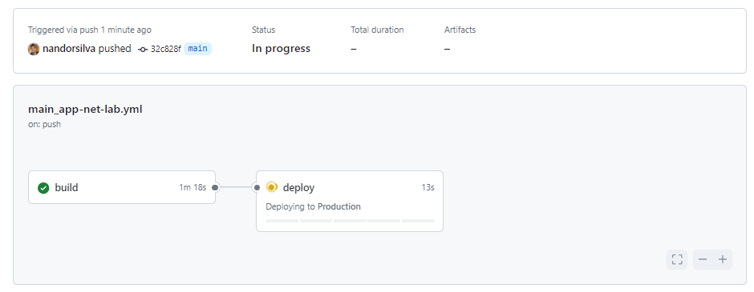

# Lab Devops


### Disclaimer
> **As configurações dos Laboratórios é puramente para fins de desenvolvimento local e estudos**


### Pré-requisitos?
* Conta github
* Conta Docker hub


## Criando um repositório

Acesse a página do github e clique em “Create Repository”


1. Coloque o nome do repositorio de sua preferencia;
2. Informe uma descrição para o repositório;
3. Configure o mesmo como privado ou público. > Um repositório privado só é acessivel
pelo seu usuário e os colaboradores do mesmo, o público tem seu código acessivel por
toda internet;
4. Clique em Create Repository.




Ao criar esse repositório já vemos alguns comandos git que podemos utilizar.


Primeiramente vamos verificar se temos o binário do git instalado na máquina.


```
git --version

```

Vamos criar um diretório para trabalharmos com o git.


```
mkdir devops-git
cd devops-git
```

Criando o repositório local.


```
 git init

```

Configurando email do repositório

```
git config --global user.name "nandorsilva"
git config --global user.email "fernandos007@gmail.com"

```

Criando nosso primeiro arquivo

```
echo "Meu primeiro versionamento" >> README.md

```

Adicione o arquivo para a área de staging

```
git add README.md

//Ou

git add .
```

Como está o status ?

```
 git status
```

Nosso primeiro commit

```
git commit -m "Meu primeiro commit"
git log

```

> O git commit é usado para salvar o estado atual dos arquivos que foram preparados no staging area. Utilizando o parâmetro -m, é possível adicionar uma mensagem ao commit, que ajuda a identificar as alterações realizadas de forma clara e concisa.


Agora que estamos familiarizados com os comandos básicos do git, podemos começar a trabalhar com repositórios remotos. Uma das principais vantagens do git é a capacidade de ter um repositório local (na nossa máquina) e um repositório remoto (no servidor). O nosso repositório remoto será hospedado no GitHub. Vamos acessar o GitHub e abrir o nosso repositório de app-net-devops.git que criamos. Ao abrir o repositório, encontraremos um guia rápido com algumas informações importantes.


Iremos trabalhar com a opção, "…or push an existing repository from the command line"


Vamos gerar um par de chaves ssh para ter uma comunicação segura entre o github e o você.

```
ssh-keygen
```

> Apenas aperte enter até a geração das chaves


Copiar a geração da chave

```
cat ~/.ssh/id_rsa.pub

```

Copie o conteudo da chave e vamos configurar o github.








Vai ficar assim


Na pagina inicial do repo


```
git remote add origin git@github.com:nandorsilva/app-net-devops.git
```

Com este comando, adicionamos uma origem remota ao nosso repositório, permitindo que o git saiba para onde enviar o código ao executarmos um comando de push.


> Execute o comando git remote add origin > Lembre-se de utilizar o comando para seu usuário.

Com o comando origin, criamos uma referência chamada 'origin' com o endereço do seu repositório, o que podemos verificar utilizando o comando:

```
git remote -v

```

Modificando para a branch Main

```
git branch -M main

```

E utilizaremos o comando push para enviar o código da nossa branch local para a branch main
da nossa origin remota

```
git push -u origin main
```

## Automação Build DockerFile docker hub.


### Criando repositório docker



### Criando Secrets para logar no docker hub


### Usando o Codespaces para criar o arquivo de workflows



## Criando o App Services na Azure


>GitHub Actions é uma plataforma de integração contínua e entrega contínua (CI/CD) que permite automatizar a sua compilação, testar e pipeline de implantação.

>Runners são agentes/servidores que executam fluxos de trabalho definidos nos arquivos de configuração de GitHub Actions, podendo executar no próprio github (Hosted) ou na máquina local (Self-hosted).


Após entrar no portal e selecionar App Services





Configurando o github para o Runners




Após a criação no repositório será criada uma pasta .github/workflows



Observe o arquivo criado dentro da pasta .github/workflows

E ao efeturar um commit da aplicação o processo de deploy é iniciado







Não esqueça de apagar a chave ssh do seu git criado anteriormente.


https://app-net-lab.azurewebsites.net/swagger/index.html

