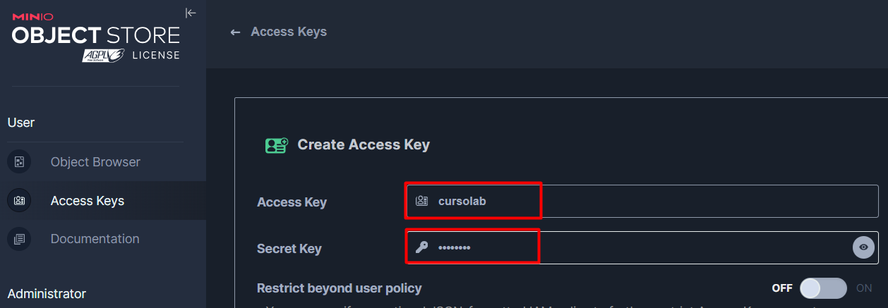
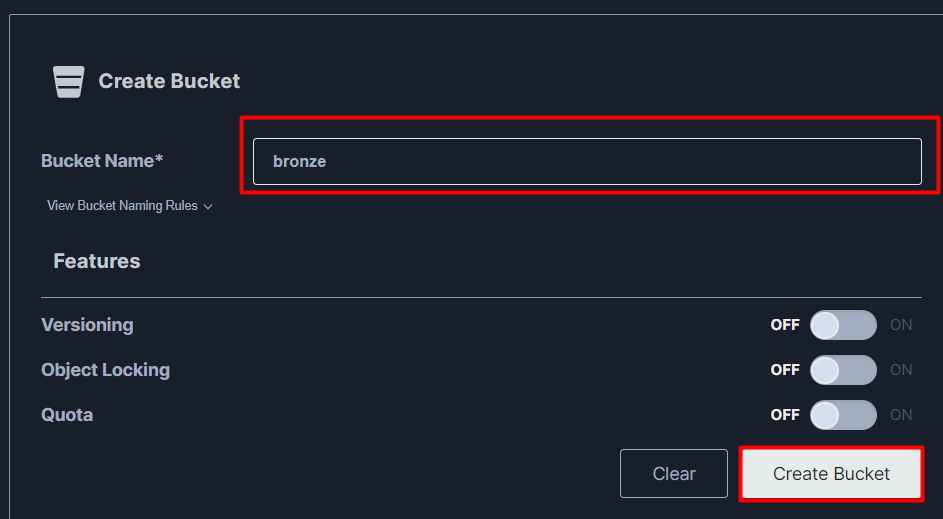

# Lab Eda - Kafka Connect


## Disclaimer
> **As configurações dos Laboratórios é puramente para fins de desenvolvimento local e estudos**


## Pré-requisitos?
* Docker
* Docker-Compose


# Instalação Kafka 

[LAB KAFKA](../lab-kafka/README.md)


## Kafka Connect


### Realizando download dos plugins dos conectores


Criando a imagem junto com o plugin do Debezium Postgres


```

cd lab-kafka-connect

docker image build -t <<usuario>>/kafka-connet-debezium-lab:v213  -f Dockerfile .
 
```

OPCIONAL - Vamos enviar a imagem para o dockerhub ??
https://hub.docker.com/

```
docker login
docker image push <<usuario>>/kafka-connet-debezium-lab:v213
```

> As imagens customizadas encontra-se no https://hub.docker.com/


Imagem criada? ...mas antes

Altere o arquivo ambiente/docker-compose.yaml da imagem criada no serviço `connect`


No diretório `/lab-eda/ambiente` execute o comando abaixo

```
cd ../lab-eda/ambiente/

docker-compose up -d grafana prometheus jmx-kafka-broker zookeeper kafka-broker zoonavigator akhq connect postgres pgadmin minio mc

docker container ls
```

Listando os plugins existentes, os padrões da imagem e do debezium que foi inserido na imagem, via arquivo `Dockerfile`

```
docker exec -it kafkaConect curl  http://localhost:8083/connector-plugins
```

## Configurando o Conector Postgres


### Provisionando Banco de dados Postgres e a ferramenta PgAdmin


Acesso para o PgAdmin http://localhost:5433/


* Login: lab-pgadmin4@pgadmin.org
* Senha : postgres    

* Nome do server: postgres
* Nome do Host Name: postgres
* database: postgres
* Username: postgres
* password: postgres

### Tela de login do PgAdmin


### Inserindo um server


### Configurando o server


### ...Se tudo deu certo o banco de exemplo com suas tabelas


### Criando os Conectores

*API rest do kafka Connect*
https://docs.confluent.io/platform/current/connect/references/restapi.html


Criando o conector PostGres

```

 cd ../../lab-kafka-connect/

curl -X PUT -d @conector-postgres.json http://localhost:8083/connectors/connector-postgres/config -H 'Content-Type: application/json' -H 'Accept: application/json'


//Ou via powershell
$response = Invoke-WebRequest -Uri "http://localhost:8083/connectors/connector-postgres/config" -Method Put -Body (Get-Content -Path "conector-postgres.json" -Raw) -ContentType "application/json"; $response.Content


```


* Observando o arquivo `conector-postgres.json` 

Algumas informações básicas sobre o connector:


* `spec.class`: Nome da classe do conector que está dentro do plugin debezium
* `spec.config.database.hostname` e `spec.config.database.port`: endereço IP ou nome de host para sua instância Sql Server, bem como a porta (por exemplo 1433)
* `spec.config.database.user` e `spec.config.database.password`: nome de usuário e senha para sua instância Sql Server
* `spec.config.database.dbname`: nome do banco de dados
* `spec.config.database.server.name`: Nome lógico que identifica e fornece um namespace para o servidor / cluster de banco de dados Sql Server específico que está sendo monitorado.
* `spec.config.table.whitelist`: lista separada por vírgulas de regex especificando quais tabelas você deseja monitorar para a captura de dados alterados


Listando os conectores

```
docker exec -it kafkaConect curl http://localhost:8083/connectors/
```

Verificando o status dos conectores

```
docker exec -it kafkaConect curl http://localhost:8083/connectors/connector-postgres/status

```

### E o Akhq ?

Vamos tirar o comentario do conector no serviço akhq do arquivo docker-compose caso ainda o tenha.

```
cd ../lab-eda/ambiente/
docker-compose up -d akhq
```


### Testando o Conector

Vamos inserir alguns registros nas tabelas e listar os tópicos do Kafka


### Inserir um registro na tabela `inventory.products`


> Para entrar nos scripts, botão direito na tabela clica em `Query Tool`

```
INSERT INTO inventory.products(	id, name, description, weight)
VALUES (default, 'Lapis', 'O melhor', 1);
```

Listando os tópicos


```
docker exec -it kafka-broker /bin/bash
kafka-topics --bootstrap-server localhost:9092 --list 
```


*Consumindo mensagem postgres.inventory.products Datasource Postgres*

```
kafka-console-consumer --bootstrap-server localhost:9092 --topic postgres.inventory.products --from-beginning
```


#### Api Rest Kafka Connect


```
exit

docker exec -it kafkaConect curl http://localhost:8083/connectors/connector-postgres/status

```

Interagindo com os connetores

```
Método PUT http://localhost:8083/connectors/connector-postgres/pause
Método GET http://localhost:8083/connectors/connector-postgres/status
Método PUT http://localhost:8083/connectors/connector-postgres/resume
```

### Configurando MinIO


Acesso para o MinIO http://localhost:9001/login

* Senha : admin
* password: minioadmin


### Configurando o MinIO







Instalando o conector do MinIO

> Não esqueçam de mudar os campos  `aws.access.key.id` e `aws.secret.access.key` do arquivo `conector-minio.json`

```
cd ../../lab-kafka-connect/

curl -X PUT -d @conector-minio.json http://localhost:8083/connectors/connector-minio/config -H 'Content-Type: application/json' -H 'Accept: application/json'


//Ou via powershell
$response = Invoke-WebRequest -Uri "http://localhost:8083/connectors/connector-minio/config" -Method Put -Body (Get-Content -Path "conector-minio.json" -Raw) -ContentType "application/json"; $response.Content


```

Listando os conectores

```
docker exec -it kafkaConect curl http://localhost:8083/connectors/
```

Será que deu certo??

Vamos inserir um novo registro na tabela products no banco de dados do Postgres

```
INSERT INTO inventory.products(	id, name, description, weight)
VALUES (112, 'Lapis', 'O melhor', 1);
```


Listando os tópicos


```
docker exec -it kafka-broker /bin/bash
kafka-topics --bootstrap-server localhost:9092 --list 
```


*Consumindo mensagem sink-products Datasource MinIO*

```
kafka-console-consumer --bootstrap-server localhost:9092 --topic sink-products --from-beginning
```
