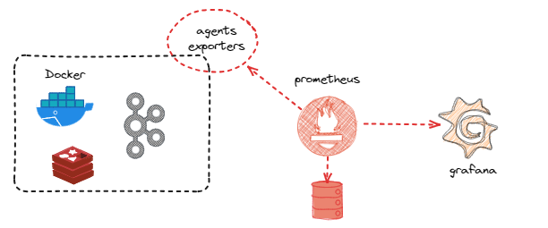
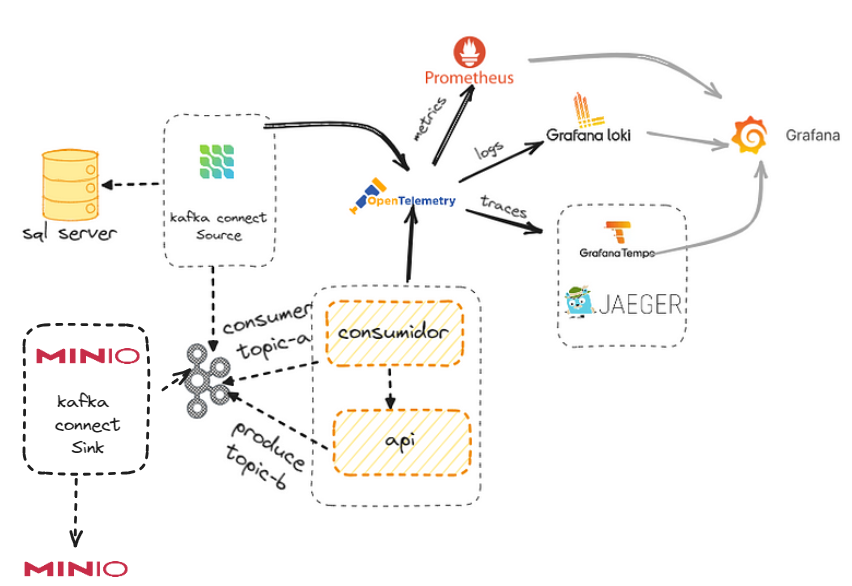

# LAB KAFKA

---
## Disclaimer
> **Esta configuração é puramente para fins de desenvolvimento local e estudos**
> 

---


## Pré-requisitos?
* Docker
* Docker-Compose

---

## Criando o ambiente Kafka com o docker compose




```

cd lab-eda/ambiente
docker compose up -d grafana prometheus jmx-kafka-broker zookeeper kafka-broker  akhq

```

## O que acontenceu ?


## Acesso WebUI dos componentes


* AKHQ http://localhost:8080/ui
* Prometeus http://localhost:9090/
* jmx-prometheus-exporter http://localhost:5556/
* Grafana http://localhost:3000/login

## Acessos

Grafana

* user : `admin`
* password : `kafka`

Verificando se os containers foram criados com sucesso

```
 docker container ls
```
Verificando as imagens que foram feitas download do docker-hub
```
 docker image ls
```

### Vamos analisar os componentes??


## Subindo as demais aplicações e validando o fluxo




```
docker compose up -d sqlserver grafana prometheus zookeeper kafka-broker akhq connect  minio tempo loki otel-collector jaeger-all-in-one 
```

Listando os plugins existentes, os padrões da imagem e do debezium que foi inserido na imagem, via arquivo `Dockerfile`

```
docker exec -it kafkaConect curl  http://localhost:8083/connector-plugins
```

## Configurando o Conector Sql

### Configurando Banco de dados CDC para SQL


Executando os scripts

```
//Linux
export  SA_PASSWORD=Password!
cat sql/init.sql | docker exec -i sqlserver /opt/mssql-tools18/bin/sqlcmd -U sa -P $SA_PASSWORD -C

//PowerShell
$SA_PASSWORD = "Password!"
Get-Content sql/init.sql | docker exec -i sqlserver /opt/mssql-tools18/bin/sqlcmd -U sa -P $SA_PASSWORD -C

```


```
//Linux
curl -X PUT -d @connect/conector-sql.json http://localhost:8083/connectors/connector-sql/config -H 'Content-Type: application/json' -H 'Accept: application/json'


 //ou no PowerShell - Windows

 $response = Invoke-WebRequest -Uri "http://localhost:8083/connectors/connector-sql/config" -Method Put -Body (Get-Content -Path "connect/conector-sql.json" -Raw) -ContentType "application/json"; $response.Content

```

Verificando o status dos conectores

```
docker exec -it kafkaConect curl  http://localhost:8083/connectors/connector-sql/status

```


Vamos tirar o comentario do conector no serviço akhq do arquivo docker-compose caso ainda o tenha.

```
docker-compose up -d akhq
```

* AKHQ http://localhost:8080/ui


```

//Linux
export SA_PASSWORD=Password!


//PowerShell
$SA_PASSWORD = "Password!"


docker exec -i sqlserver /opt/mssql-tools18/bin/sqlcmd -U sa -P $SA_PASSWORD -d dbEcommerce  -Q "INSERT INTO produtos(nome,descricao)  VALUES ('Lapis','lapis de escrever');" -C


```

Listando os tópicos


```
docker exec -it kafka-broker /bin/bash
kafka-topics --bootstrap-server localhost:9092 --list 

kafka-console-consumer --bootstrap-server localhost:9092 --topic server.dbEcommerce.dbo.produtos --property print.headers=true  --property print.timestamp=true --property print.key=true --property print.value=true --property print.partition=true --from-beginning

```


### Jaeger


O suporte de rastreamento é baseado em dois projetos de código aberto:

* OpenTracing
* Jaeger

Ambos os projetos fazem parte da Cloud Native Computing Foundation, https://www.cncf.io/.

> OpenTracing é uma API independente para rastreamento distribuído que oferece suporte a diferentes protocolos e linguagens de programação. O próprio OpenTracing não implementa o rastreamento. Ele fornece apenas uma API interoperável para várias linguagens de programação. Outros projetos usam essas APIs para construir a implementação de rastreamento real sobre ela, como por exemplo o Jaeger.

O cliente Jaeger é executado como parte de seu aplicativo. Por exemplo, produtor ou consumidor do Kafka, ou um dos componentes Kafka, como Kafka Connect ou Mirror Maker 2.0.

O aplicativo usa a API OpenTracing para criar extensões de rastreamento e anexar IDs de rastreamento a solicitações de saída. O cliente Jaeger é responsável por propagar as informações sobre os spans para o agente Jaeger. 


O cliente geralmente não envia todos os rastreamentos ao agente, mas geralmente apenas uma pequena porcentagem, uma amostragem.

> http://localhost:16686/


# A imagem jaeger contem:

* `Agente` é o componente localizado no aplicativo para reunir os dados de rastreamento Jaeger localmente. Ele lida com a conexão e o controle de tráfego para o Coletor, bem como o enriquecimento dos dados.

* `O Jaeger Coletor`  é o componente responsável por receber os spans que foram capturados pelos Agente e gravá-los em um armazenamento.

* `Jaeger Consult`a é um serviço que recupera rastros do armazenamento e hospeda a interface do usuário para exibi-los.

---

## Estratégias de implantação

`All-in-One`: Esta é uma configuração fácil de implantar, boa para experimentar o produto, desenvolvimento e uso de demonstração. Você pode executá-lo como um binário predefinido ou uma imagem Docker. `Opção default`.

`Produção`: focado nas necessidades do ambiente de produção para alta disponibilidade e escalabilidade. Ele implanta cada serviço de back-end de forma independente e oferece suporte a várias réplicas e opções de dimensionamento. Ele também usa armazenamento de back-end persistente para manter os dados de rastreamento resilientes. Atualmente, ele oferece suporte às soluções de armazenamento `Elasticsearch`, `Cassandra` e `kafka`, com Elasticsearch como a solução recomendada para ambientes de produção.

`Streaming`: para ambientes de alta carga, esta configuração adiciona Kafka à estratégia de implantação de produção para tirar a pressão do armazenamento de back-end. Se você precisar executar a lógica de pós-processamento nos rastreamentos, será mais fácil executar antes de gravar no armazenamento.


Executando a aplicação Net para leitura das mensagens em Kafka


```
docker-compose up -d kafka-net-api-obs kafka-net-worker-obs

```

* http://localhost:16686/
* http://localhost:3000/


Criando mais produtos

```

docker exec -i sqlserver /opt/mssql-tools18/bin/sqlcmd -U sa -P $SA_PASSWORD -d dbEcommerce  -Q "INSERT INTO produtos(nome,descricao)  VALUES ('Lapis','lapis de escrever');" -C

```